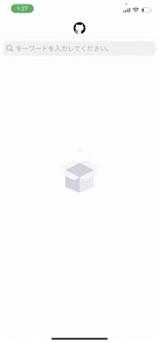

# 株式会社ゆめみ iOS エンジニアコードチェック課題

## 概要

本プロジェクトは株式会社ゆめみのコードチェック課題です。

## アプリ仕様

本アプリは GitHub のリポジトリーを検索するアプリです。
|サンプル1|サンプル2|
|:-:|:-:|
|||

## 環境

- IDE：Xcode 13.3.1
- Swift：Swift 5.5
- 開発ターゲット：15.0

## 使用ライブラリ
- Alamofire
- AlamofireImage
- LicensePlist
- PKHUD
- Charts
- lottie-ios
- JXMarqueeView

---

### **[Alamofire](https://github.com/Alamofire/Alamofire)**

**インストール方法(CocoaPods)**
```ruby
pod 'Alamofire'
```

**使用箇所**

(Alamofireを使用してコードを簡略化しました。)

通信処理全て

---
### **[AlamofireImage](https://github.com/Alamofire/AlamofireImage)**

**インストール方法(CocoaPods)**

```ruby
pod 'AlamofireImage', '~> 4.1'
```

**使用箇所**

(AlamofireImageを使用してコードを簡略化しました。)


---
### **[LicensePlist](https://github.com/mono0926/LicensePlist)**

**インストール方法(CocoaPods)**
```ruby
pod 'LicensePlist'
```

**使用箇所**

(ライブラリのライセンスをアプリの設定に表示しています。)

|手順1|手順2|
|:-:|:-:|
|||

---
### **[PKHUD](https://github.com/pkluz/PKHUD)**

**インストール方法(CocoaPods)**
```ruby
pod 'PKHUD', '~> 5.0'
```

**使用箇所**

(検索を実行した後、ユーザーがフリーズしたと勘違いしないようにローディング画面を追加しました。)


---
### **[Charts](https://github.com/danielgindi/Charts)**

インストール方法(CocoaPods)
```ruby
pod 'Charts'
```

**使用箇所**

(リポジトリの使用言語のグラフが表示されます。)


---
### **[lottie-ios](https://github.com/airbnb/lottie-ios)**

**インストール方法(CocoaPods)**
```ruby
pod 'lottie-ios'
```

**使用箇所**

(リポジトリ格納庫が空の場合、アニメーションを表示します。)


---
### **[JXMarqueeView](https://github.com/pujiaxin33/JXMarqueeView)**

**インストール方法(CocoaPods)**
```ruby
pod 'JXMarqueeView'
```

**使用箇所**

(Viewの幅よりbioが長い場合、流れる文字になります。)


---
## 課題をやるにあたっての問題点

https://api.github.com/search/repositories?q=Swift

こちらのAPIのWatcher数が正常に取得できていないと思われます。(2022/05/20)

必ずスター数と同じ結果が返却されます。


間違った数値を表示する事によってUXが損なわれると考えた為、

動作に「Watcher数」が含まれていましたが除外しました。

---

## 課題に対する自己評価

||難易度|課題|評価|
|:-:|:-:|:-:|:-:|
|<td bgcolor="#362B2E"><font color="#EC9D9E">初級|ソースコードの可読性の向上|5/5|
|<td bgcolor="#362B2E"><font color="#EC9D9E">初級|ソースコードの安全性の向上|5/5|
|<td bgcolor="#362B2E"><font color="#EC9D9E">初級|バグを修正|5/5|
|<td bgcolor="#362B2E"><font color="#EC9D9E">初級|Fat VC の回避|4/5|
|<td bgcolor="#3A382F"><font color="#D8B967">中級|プログラム構造をリファクタリング|2/5|
|<td bgcolor="#3A382F"><font color="#D8B967">中級|アーキテクチャを適用|3/5|
|<td bgcolor="#3A382F"><font color="#D8B967">中級|テストを追加|2/5|
|<td bgcolor="#293625"><font color="#ACDE5E">ボーナス|UI をブラッシュアップ|5/5|
|<td bgcolor="#293625"><font color="#ACDE5E">ボーナス|新機能を追加|5/5|

---

## アピールポイント(機能紹介)

### UXの向上系

**インターネット接続の確認**
|オンライン|オフライン|
|:-:|:-:|
|||

**入力の有無**
|有|無|
|:-:|:-:|
|||

**検索結果の有無**
|有|無|
|:-:|:-:|
|||

**通信失敗(レートリミットの場合)**
|成功|失敗|
|:-:|:-:|
|||

**自動更新**

一番下までスクロールすると自動で更新されます。


**ワンタップアクセス**
|アカウントにアクセス|リポジトリにアクセス|
|:-:|:-:|
|||

**多言語対応**
|英語|日本語|
|:-:|:-:|
|||

**入力の中断**


**インジゲーター**

「読み込み中である」という事をユーザーに伝える


**空の場合のアニメーション表示**

「今は表示するものがないよ」という事をユーザーに伝える


---

### UIのブラッシュアップ系

**言語ラベル**


**流れる文字**


**背景色に言語カラーのグラデーションを使用**


**言語の使用割合をグラフで表示**


---

## 改善点

**テストについての知識不足**

いままでテストを書くことがなかったので書き方がわからなかった。

自分なりに調べて書いてみたが正しく書けているのかも分からない。

**アーキテクチャについての知識不足**

自分なりにMVVMで書いたつもりだが、なんちゃってMVVMになっている可能性がある

**リファクタリング不足の可能性**

正直、どこまで細かく分けるべきか分からなかった

分けると引数が多くなりそうな箇所は読みにくくなる可能性があると思ったので、
複数の関数に分けずにまとめているがこの判断が合っているのか分からない

